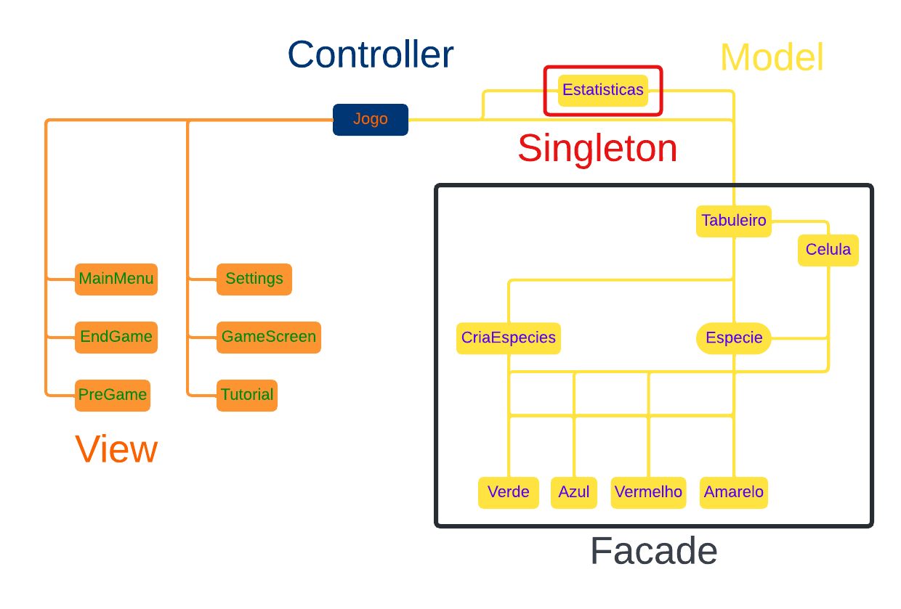
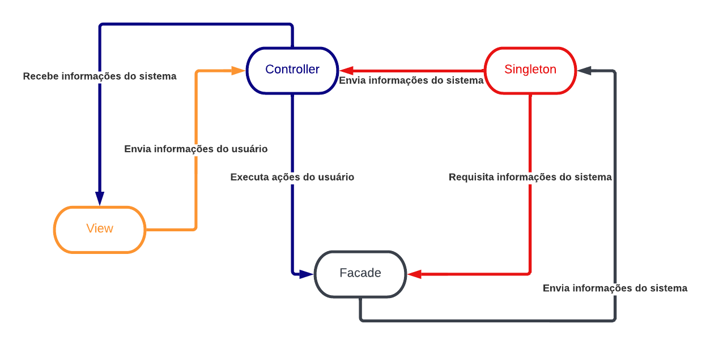

#  Projeto Extinction

# Descrição Resumida do Projeto/Jogo

Em nosso jogo, temos quatro espécies diferentes que lutam entre si em um tabuleiro para obter comida. Cada espécie possui três atributos indo de 0 a 10, sendo eles: velocidade, inteligência e força. Para jogar, o jogador escolhe uma das quatro espécies e seleciona seus atributos, que juntos devem somar dez pontos. Seu objetivo é que no final do jogo apenas sua espécie sobreviva e as outras três sejam extintas.

# Equipe
* Bernardo Panka Archegas - 246970
* Luiz Henrique Yuji Delgado Oda - 247255

# Arquivo Executável do Jogo

<a id="raw-url" href="https://raw.githubusercontent.com/Melhor-dupla-de-POO/Trabalho-Final/main/extinction.jar">Download</a>

# Slides do Projeto

## Slides da Prévia

[Slides](https://docs.google.com/presentation/d/1jbVQLHXSmoIzbXC1I0b6tI3u2GO_QiLP6dFZnplVF5k/edit#slide=id.g12eddf9782c_0_10)

## Slides da Apresentação Final

[Slides](https://docs.google.com/presentation/d/1HpqCt5N_N9NJoHFYNiT1HZXO-wRYFXCIIAiSLM9TnwM/edit#slide=id.g12029d56449_0_15)

## Relatório de Evolução

Não ocorreram muitas mudanças na ideia do jogo ao longo do desenvolvimento. Porém, mudamos um pouco o design do código. 
No início, desejávamos utilizar o pattern strategy para englobar diferentes interações entre espécies. 
No entanto, optamos por deixar todas as interações iguais para facilitar o código e o balanceamento do jogo.

# Destaques de Código

~~~java
public enum Cores {
	AMARELO, VERMELHO, VERDE, AZUL;
	…
}
~~~

Temos um trecho de código onde utilizamos enum para tratar as diferentes cores de espécies. Com ele, podemos processar as cores diretamente por meio das 
palavras-chave "AMARELO", "VERMELHO", "VERDE" e "AZUL". Isso aumenta diretamente a legibilidade do código.

# Destaques de Orientação a Objetos

## Diagrama de Classes usada no destaque abaixo:

## Código mostrando polimorfismo

~~~java
Celula() {
	this.criaturas = new ArrayList<Especie>();
	comida = false;
}
~~~

Neste recorte, temos o construtor da classe Celula, que possuí um ArrayList de Especie. 
Com ele, podemos adicionar facilmente outros tipos de Especies fazendo alterações mínimas no código da classe Celula. 
Além disso, aproveitamos o conceito de polimofismo utilizando a classe abstrata Especie como o tipo do ArrayList, podendo assim armazenar objetos 
das classes Amarelo, Vermelho, Azul ou Verde também.

## Diagrama de Classes usada no destaque abaixo:

## Código da sobrecarga do construtor da classe Especie

~~~java
// Construtor sobrecarregado
Especie(int x, int y, int velocidade, int inteligencia, int tamanho, Tabuleiro tabuleiro, Cores cor) {
	…
}
	
Especie(Especie pai) {		
	…
}
~~~

# Destaques de Pattern

## Diagrama do Singleton

## Código do Singleton

~~~java
public Class Estatisticas {
	// Singleton
	…
	private static Estatisticas estatisticas = null;
	…
	private Estatisticas(…) {
		…
	}
	public static Estatisticas getStats(…) {
		if(estatisticas == null) {
			estatisticas = new Estatisticas(…);
		}
		estatisticas.atualizaStats();
		return estatisticas;
	}
	private void atualizaStats() {
		// Atualiza as estatisticas que sao mostradas 
		// para o usuario durante o jogo
		…
	}
	…
}
~~~

O pattern adotado no código acima foi o singleton. 
Por ser uma classe que retorna as estatísticas do tabuleiro, não é necessária mais de uma instância da classe. 
Uma das vantagens é a economia de recursos enquanto o jogo roda, já que o pattern evita a criação de várias instâncias da classe. 
Este pattern é chamado pela classe Jogo e busca informações em um objeto da classe Tabuleiro.

## Diagrama do Facade

## Código do Facade

~~~java
Class Tabuleiro {
	// Facade
	Celula[][] campo;
	…
	public void iniciaRodada(…) {
		// Inicializa as comidas e coloca as criaturas no canto do tabuleiro
		…
		campo[i][j].resetaComida();
		ArrayList<Especie> temp = this.getCriaturas();
		for(Especie i : temp) {
			i.settarPosicaoInicial();
			this.adicionaCriatura(i);
		}
	}
	public void jogaInstante(…) {
		// Roda um frame da rodada
		// Itera por todas as criaturas e move as que precisam mover (depende da velocidade)
		…
		ArrayList<Especie> temp = this.getCriaturas();
		for(Especie i : temp) {
			…
			this.mover(i);
		}
	}
	public void mover(…) {
		// Move a criatura
		// Primeiro pega o campo de visao da criatura (baseado na inteligencia)
		// Se existe uma comida no campo de visao, 
		// ele pega a comida mais proxima e anda na direcao dela
		// Se nao tiver comida, ela ve se pode matar alguem 
		// (se tem alguem mais fraco ao seu redor)
		// Se nao tiver comida nem morte, 
		// ela anda random com um incentivo a ir ao meio do tabuleiro
		…
		this.campo[x][y].removeCriatura(criatura);
		this.campo[novoX][novoY].adicionaCriatura(criatura);
	}
	public void encerraRodada() {
		// Tira todo mundo das suas posicoes
		// Mata e reproduz as criaturas baseado na quantidade de comida
		// Reinicia as comidas no tabuleiro
		…
		campo[i][j].encerraRodada();
	}
	…
}
~~~

No código acima, temos a classe Tabuleiro. Esta classe segue o pattern Facade, sendo uma classe que oculta várias outras. 
Sendo assim, a classe Jogo não acessa as classes Celula e Especie, acessando apenas a classe Tabuleiro, que modifica estes outros objetos. 
Um exemplo é o método encerraRodada. Enquanto o método acessa objetos da classe Celula, a classe Jogo não os acessa, apenas chama o método do Tabuleiro.

# Conclusões e Trabalhos Futuros

No geral, o projeto foi bom. Foi possível aprender bastante sobre a importância de POO e de uma organização melhor de código. No entanto, não foi possível implementar tudo que foi planejado. 
Devido à falta de tempo, não foi possível implementar o pattern strategy para as interações entre criaturas. Além disso, queriamos aumentar a complexidade e balancear melhor o jogo, o que não foi possível.

# Diagramas

## Diagrama Geral da Arquitetura do Jogo

