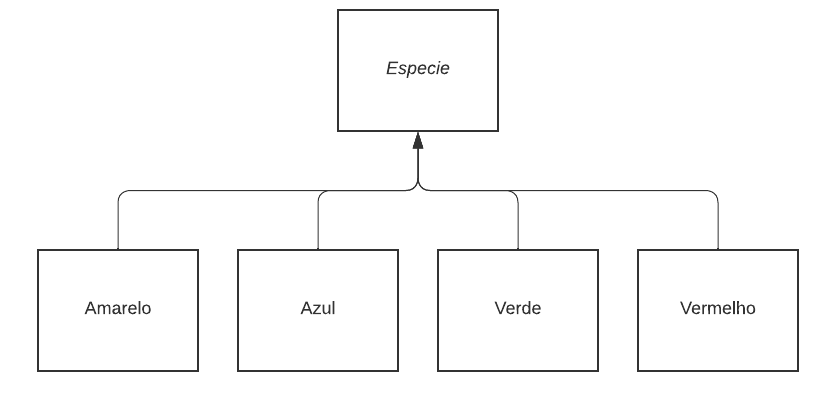
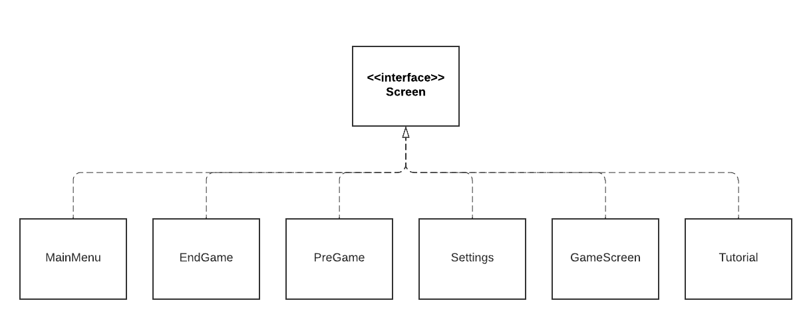

#  Projeto Extinction

# Descrição Resumida do Projeto/Jogo

Em nosso jogo, temos quatro espécies diferentes que lutam entre si em um tabuleiro para obter comida. Cada espécie possui três atributos indo de 0 a 10, sendo eles: velocidade, inteligência e força. Conforme o jogo vai passando, as espécies vão sofrendo mutações e alterando suas habilidades. 

Para jogar, o jogador escolhe uma das quatro espécies e seleciona seus atributos, que juntos devem somar dez pontos. Seu objetivo é que no final do jogo apenas sua espécie sobreviva e as outras três sejam extintas.

# Equipe
* Bernardo Panka Archegas - 246970
* Luiz Henrique Yuji Delgado Oda - 247255

# Arquivo Executável do Jogo

<a id="raw-url" href="https://raw.githubusercontent.com/Melhor-dupla-de-POO/Trabalho-Final/main/extinction.jar">Download</a>

# Slides do Projeto

## Slides da Prévia

[Slides](https://docs.google.com/presentation/d/1jbVQLHXSmoIzbXC1I0b6tI3u2GO_QiLP6dFZnplVF5k/edit#slide=id.g12eddf9782c_0_10)

## Slides da Apresentação Final

[Slides](https://docs.google.com/presentation/d/1HpqCt5N_N9NJoHFYNiT1HZXO-wRYFXCIIAiSLM9TnwM/edit#slide=id.g12029d56449_0_15)

## Relatório de Evolução

Durante a realização do projeto, nós estávamos com dificuldade em integrar o Controller (Classe Jogo) com o Model, então acabamos decidindo fazer com que o Tabuleiro agisse como Facade, facilitando as interações. 

Além disso, tivemos que realizar várias mudanças para melhorar o balanceamento do jogo. As mais notáveis foram fazer com que a função de penalidade da energia da criatura se tornasse quadrática; não permitir que comidas fossem posicionadas na borda do tabuleiro; colocar as espécies mais próximas umas das outras para aumentar as relações interespécies; modificar a função de mover as criaturas para balancear a efetividade dos atributos.

No entanto, com a orientação a objetos e suas estratégias de encapsulamento e maximizar a coesão e minimizar o acoplamento, implementar essas mudanças foi relativamente tranquilo.

Por último, como o jogo precisa ser realizado em um tabuleiro grande para que as mutações e a seleção natural tenham efeito, nós precisávamos que o design das criaturas fosse bem pixelado. Dessa forma, para que tudo estivesse no mesmo tema, mudamos a arte do jogo para algo mais pixelado e acabamos fazendo a maioria dos sprites utilizados. 

# Destaques de Código

~~~java
// Setta os atributos iniciais das 4 especies
// A especie escolhida vai ter os atributos escolhidos pelo usuario
// As nao escolhidas vao ter atributos aleatorios, de modo que cada atributo é no max 1
ArrayList<Integer> list = new ArrayList<Integer>();
for (int i = 1; i <= 8; i++) {
	for (int j = i + 1; j <= 9; j++) {
		int speed = i, intelligence = j - i, strength = 10 - j;
		list.add(100 * speed + 10 * intelligence + strength);
	}
}
Random rand = new Random();
int[] choose = new int[4];
for (int i = 0; i < 4; i++) {
	int id = rand.nextInt(list.size());
	choose[i] = list.get(id);
}
…
~~~

Como o usuário escolhe uma das espécies para jogar, nós precisamos settar os atributos iniciais das outras 3 espécies. Para isso, nós pegamos todas as distribuições de pontos na qual todos os atributos >= 1 e selecionamos uma dessas distribuições de forma aleatória.

O código utilizado é o mais eficiente possível, o que é muito importante, visto que, se decidirmos aumentar a quantidade de atributos que uma espécie pode ter ou o número de pontos a serem distribuídos, a quantidade de distribuições se torna massiva.

~~~java
public enum Cores {
	AMARELO, VERMELHO, VERDE, AZUL;
	…
}
~~~

Temos um trecho de código onde utilizamos enum para tratar as diferentes cores de espécies. Com ele, podemos processar as cores diretamente por meio das 
palavras-chave "AMARELO", "VERMELHO", "VERDE" e "AZUL". Isso aumenta diretamente a legibilidade do código.

# Destaques de Orientação a Objetos

## Diagrama de Classes usada no destaque abaixo:

## Código mostrando polimorfismo

~~~java
public void joga(Tabuleiro tab, int round) {
	for(Especie i : criaturas) {
		if(i.devoAndar(round)) {
			tab.mover(i);
		}
	}
}
~~~

Neste recorte, temos uma função da classe Celula, que possui um ArrayList de Especie.

Especie é uma classe abstrata que pode ser qualquer uma das 4 espécies do Jogo (Azul, Amarelo, Verde e Vermelho). Com isso, fazemos com que a Celula lide apenas com Especie, de modo que podemos adicionar outras espécies ou modificar as existentes fazendo alterações mínimas no código de outras classes.

Além disso, aproveitamos o conceito de polimofismo utilizando a classe abstrata Especie como o tipo do ArrayList, podendo assim armazenar objetos 
das classes Amarelo, Vermelho, Azul ou Verde também.

## Diagrama de Classes usada no destaque abaixo:

## Código mostrando o uso de interface para a parte gráfica

~~~java
public class TelaQualquer implements Screen {
	Jogo game;
	…
	@Override
	public void render() {
		…
		game.setScreen(new NovaTela(game));
	}
	…
}
~~~
Neste recorte, temos uma classe genérica de uma das telas do jogo implementando a interface Screen do LibGDX. Essa interface tem a função render(), que é responsável por "desenhar" os elementos na tela. 

Na própria função render pode ser chamado o método setScreen, que altera a tela atual. Dessa forma, a classe Jogo apenas lida com a interface Screen, e ela apenas renderiza a tela atual, que pode ser qualquer uma das telas utilizadas no projeto.

# Destaques de Pattern

## Singleton

~~~java
public Class Estatisticas {
	// Singleton
	…
	private static Estatisticas estatisticas = null;
	…
	private Estatisticas(…) {
		…
	}
	public static Estatisticas getStats(…) {
		if(estatisticas == null) {
			estatisticas = new Estatisticas(…);
		}
		estatisticas.atualizaStats();
		return estatisticas;
	}
	private void atualizaStats() {
		// Atualiza as estatisticas que sao mostradas 
		// para o usuario durante o jogo
		…
	}
	…
}
~~~

O pattern adotado no código acima foi o singleton. 

Por ser uma classe que retorna as estatísticas do tabuleiro, não é necessária mais de uma instância da classe. 

Uma das vantagens é a economia de recursos enquanto o jogo roda, já que o pattern evita a criação de várias instâncias da classe. 

Este pattern é chamado pela classe Jogo e busca informações em um objeto da classe Tabuleiro.

## Facade

~~~java
Class Tabuleiro {
	// Facade
	Celula[][] campo;
	…
	public void iniciaRodada(…) {
		// Inicializa as comidas e coloca as criaturas no canto do tabuleiro
		…
		campo[i][j].resetaComida();
		ArrayList<Especie> temp = this.getCriaturas();
		for(Especie i : temp) {
			i.settarPosicaoInicial();
			this.adicionaCriatura(i);
		}
	}
	public void jogaInstante(…) {
		// Roda um frame da rodada
		// Itera por todas as criaturas e move as que precisam mover (depende da velocidade)
		…
		ArrayList<Especie> temp = this.getCriaturas();
		for(Especie i : temp) {
			…
			this.mover(i);
		}
	}
	public void mover(…) {
		// Move a criatura
		// Primeiro pega o campo de visao da criatura (baseado na inteligencia)
		// Se existe uma comida no campo de visao, 
		// ele pega a comida mais proxima e anda na direcao dela
		// Se nao tiver comida, ela ve se pode matar alguem 
		// (se tem alguem mais fraco ao seu redor)
		// Se nao tiver comida nem morte, 
		// ela anda random com um incentivo a ir ao meio do tabuleiro
		…
		this.campo[x][y].removeCriatura(criatura);
		this.campo[novoX][novoY].adicionaCriatura(criatura);
	}
	public void encerraRodada() {
		// Tira todo mundo das suas posicoes
		// Mata e reproduz as criaturas baseado na quantidade de comida
		// Reinicia as comidas no tabuleiro
		…
		campo[i][j].encerraRodada();
	}
	…
}
~~~

No código acima, temos a classe Tabuleiro. Esta classe segue o pattern Facade, sendo uma classe que oculta várias outras. 

Sendo assim, a classe Jogo não acessa as classes Celula e Especie, acessando apenas a classe Tabuleiro, que modifica estes outros objetos. 

Um exemplo é o método encerraRodada. Enquanto o método acessa objetos da classe Celula, a classe Jogo não os acessa, apenas chama o método do Tabuleiro.

# Conclusões e Trabalhos Futuros

No geral, o projeto foi muito bom. Foi possível aprender bastante sobre a importância dos conceitos de orientação a objetos e de uma organização melhor de código. 

Para o futuro, temos várias ideias de como melhorar o projeto:
- Construir um tutorial mais intuitivo. Nosso jogo possui dinâmicas bem complexas e o ideal é que o jogador consiga entender sozinho como aproveitá-lo.
- Melhorar o balanceamento.
- Permitir que o jogador escolha outros aspectos do jogo, ex: tamanho do tabuleiro, quantidade de comida, etc.
- Acrescentar novos atributos além de velocidade, inteligência e força.

# Diagramas

## Diagrama Geral da Arquitetura do Jogo

